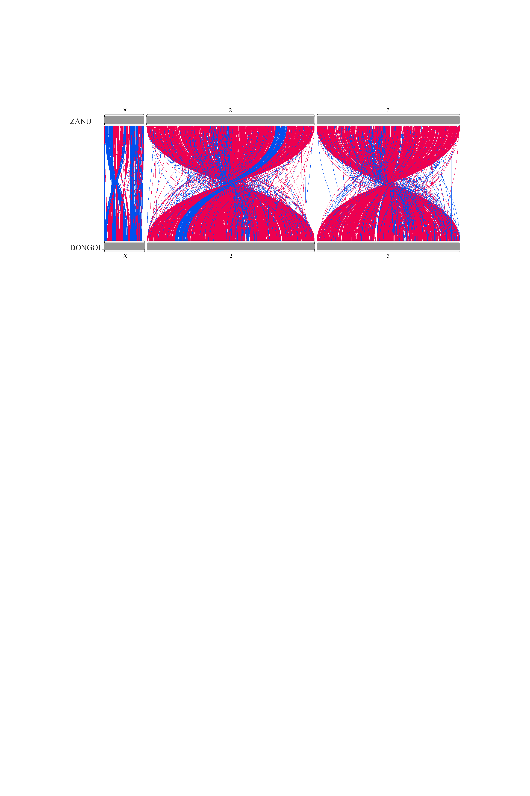

```{r setup, warning=FALSE, message=FALSE}
knitr::opts_chunk$set(echo = TRUE, warning=FALSE, message=FALSE)
```

# Import libraries

```{r}
library(RIdeogram)
library(stringi)
library(magick)
```

# Obtain the data

```{r}
DONGOLA <- read.csv('https://raw.githubusercontent.com/AntonZamyatin/r-course/main/HW3/DONGOLA_genes.tsv', sep = '\t')
ZANU <- read.csv('https://raw.githubusercontent.com/AntonZamyatin/r-course/main/HW3/ZANU_genes.tsv', sep = '\t')
gene_mapping <- read.csv('https://raw.githubusercontent.com/AntonZamyatin/r-course/main/HW3/gene_mapping.tsv', sep = '\t')
```

# Create the karyotype file

We will obtain the data on chromosomal lengths from the paper (https://doi.org/10.1093%2Fgigascience%2Fgiab017)

```{r}
karyotypes <- 
  data.frame(Chr=c('X',2,3, 
                   'X',2,3), 
             Start=c(0,0,0,
                     0,0,0), 
             End=c(27238055,114783175,97973315,
                   26913133,111988354,95710210), 
             fill=c(969696,969696,969696,
                    969696,969696,969696), 
             species=c('ZANU', 'ZANU', 'ZANU', 
                       'DONGOLA', 'DONGOLA', 'DONGOLA'), 
             size=c(12,12,12, 
                    12,12,12), 
             color=c(252525,252525,252525, 
                     252525,252525,252525))
```

# Pre-process gene_mapping dataframe

```{r}
gene_mapping <-
  gene_mapping[gene_mapping$contig %in% c("2", "3", "X"), ]

reg <- gregexpr("NC_\\d+\\.\\d*,",gene_mapping$DONG)
gene_mapping <- gene_mapping[do.call(rbind, reg) == 1, ]

reg <- gregexpr("NC_\\d+\\.\\d*,",gene_mapping$DONG)
DONG_chr <- unlist(regmatches(gene_mapping$DONG, reg))
chr_names <- data.frame(row.names=c("NC_053517.1,","NC_053518.1,","NC_053519.1,"), name=c(2,3,1))
DONG_chr <- chr_names[DONG_chr, ]
gene_mapping$DONG_chr <- DONG_chr

gene_mapping$contig <- ifelse(gene_mapping$contig == "X", 
                              1, as.integer(gene_mapping$contig))
```

# Create file with synteny comparison, get the picture using RIdeogram

```{r}
row.names(DONGOLA) <- DONGOLA$ID
row.names(ZANU) <- ZANU$ID

ZANU_genes <- gene_mapping$name

reg <- gregexpr("gene-.*",gene_mapping$DONG)
DONG_genes <- unlist(regmatches(gene_mapping$DONG, reg))


fill <- 
  ifelse(DONGOLA[DONG_genes, "strand"] == ZANU[ZANU_genes, "strand"],
         '0050EE', 'EE0050')
synteny <-
  data.frame(Species_1 = gene_mapping$contig,
             Start_1 = ZANU[ZANU_genes, "start"],
             End_1 = ZANU[ZANU_genes, "end"],
             Species_2 = gene_mapping$DONG_chr,
             Start_2 = DONGOLA[DONG_genes, "start"],
             End_2 = DONGOLA[DONG_genes, "end"], 
             fill = fill)

synteny <- synteny[synteny$Species_1 == synteny$Species_2,]

ideogram(karyotype = karyotypes, synteny = synteny, Lx = 100)
convertSVG("chromosome.svg", device = "png", height=15, width=10)

```

# Final image: blue - same strand, red - different strand

